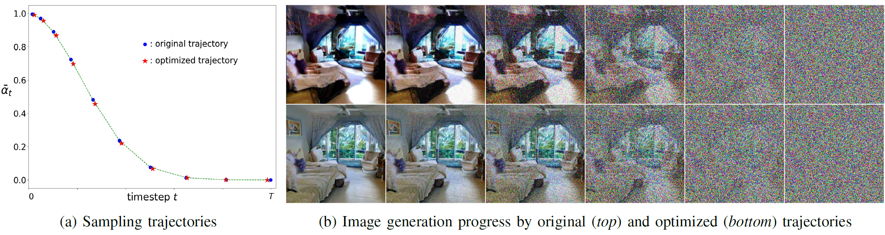

# Variance-Reduction Guidance: Sampling Trajectory Optimization for Diffusion Models
*[Shifeng Xu](https://www.linkedin.com/in/shifeng-xu-a1b93517/), 
 [Yanzhu Liu](https://openreview.net/profile?id=~Yanzhu_Liu2), 
 [Adams Wai-Kin Kong](https://personal.ntu.edu.sg/AdamsKong/)*

Official Github Repo for Variance-Reduction Guidance: Sampling Trajectory Optimization for Diffusion Models

Sampling process of DPM-Solver with order=2, schedule= *quadratic* and steps=10. 
(a) Original and optimized trajectories. 
The former has noise level sequence as 
{0.995, 0.97, 0.88, 0.72, 0.48, 0.23, 0.075, 0.0137, 0.00118, 0.000040}, and the latter has 
{0.991, 0.95, 0.86, 0.69, 0.45, 0.22, 0.068, 0.0129, 0.00121, 0.000054}. 
(b) Column 1 is generated images, column 6 is the initial Gaussian noises, 
and columns 2 - 5 are the intermediate results of the sampling progress. 

## Abstract
Diffusion models have become emerging generative models. 
Their sampling process involves multiple steps, 
and in each step the models predict the noise from a noisy sample. 
When the models make prediction, the output deviates from the ground truth, 
and we call such a deviation as *prediction error*. 
The prediction error accumulates over the sampling process and deteriorates generation quality. 
This paper introduces a novel technique for statistically measuring the prediction error 
and proposes the Variance-Reduction Guidance (**VRG**) method to mitigate this error. 
VRG does not require model fine-tuning or modification. 
Given a predefined sampling trajectory, it searches for a new trajectory 
which has the same number of sampling steps but produces higher quality results.
VRG is applicable to both conditional and unconditional generation. 
Experiments on various datasets and baselines demonstrate that 
VRG can significantly improve the generation quality of diffusion models. 

